# Dotfiles

### Packages and scripts used

* Distribution - [Manjaro](https://manjaro.org/)
* Window manager - [i3](https://i3wm.org/)
* Lock - [i3lock-color](https://github.com/PandorasFox/i3lock-color)
* Terminal - [URxvt](https://linux.die.net/man/1/urxvt)
* File browser - [Ranger](https://ranger.github.io/)
* Shell - [zsh](https://www.zsh.org/)
* zsh manager - [oh-my-zsh](http://ohmyz.sh/)
* Status bar - [Polybar](https://github.com/jaagr/polybar)
* Theme creator - [pywal](https://github.com/dylanaraps/pywal)
* Text Editor - [vim](https://www.vim.org/)
* Vim plugin manager - [Plug](https://github.com/junegunn/vim-plug)
* Application launcher - [rofi](https://github.com/DaveDavenport/rofi)
* Conky
* Stow
* Keyboard backlight manager - [msi-keyboard](https://github.com/bparker06/msi-keyboard)

### Features

* pywal script updates the colors for polybar, vim, terminal, ranger, keyboard and i3
* polybar underlines change color on events (high temperature or battery charging)

### Setup

Clone the repo to your machine, make sure you have all the necessary packages installed (listed above). Then remove the original files and use stow to symlink the ones from the repo. In order to apply the custom oh-my-zsh theme you need to symlink it to the oh-my-zsh themes directory.

### Usage
using `wal -i <image>` with an image you want to generate theme from will switch the colors to the ones you want. Can be done from rofi or terminal. The color-scheme persists on reboot.
***
## Screenshots

Some screenshots from themes I use the most

#### Firewatch-red theme

[Wallpaper](http://blog.camposanto.com/post/138965082204/firewatch-launch-wallpaper-when-we-redid-the)

###### Desktop

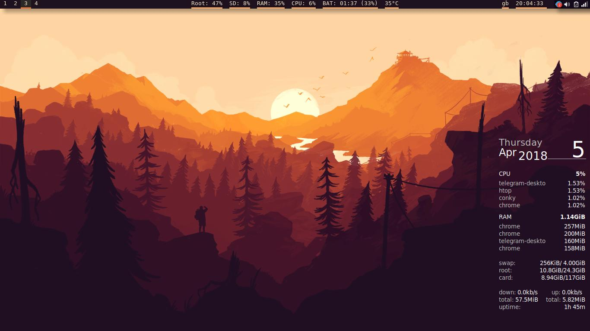

###### Terminals

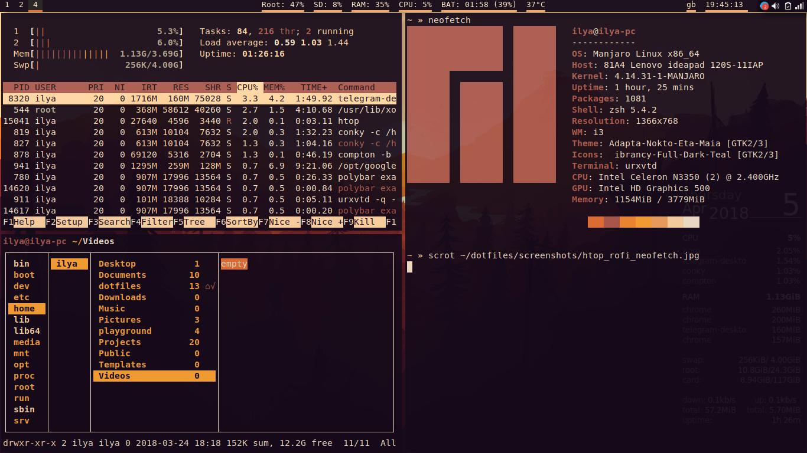

###### rofi

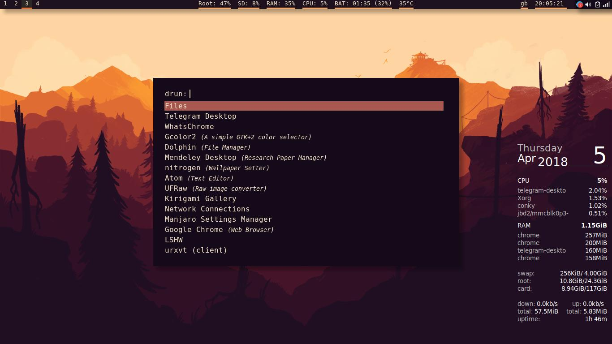

###### Lock screen

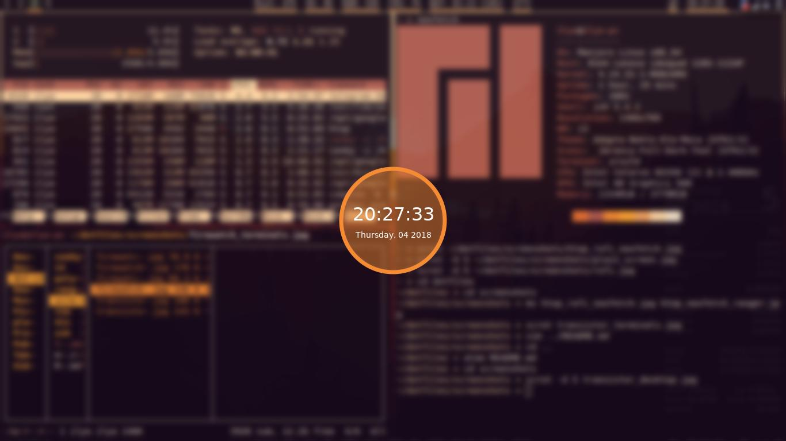

#### Transistor theme

[Wallpaper](https://wallup.net/transistor-video-games-red-transistor/)

###### Desktop

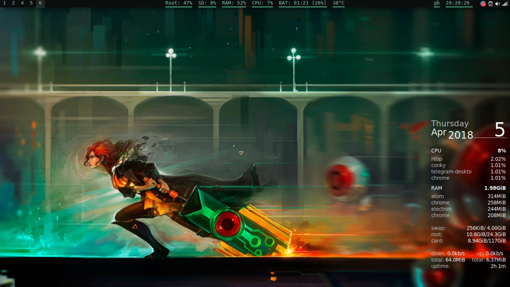

###### Terminals

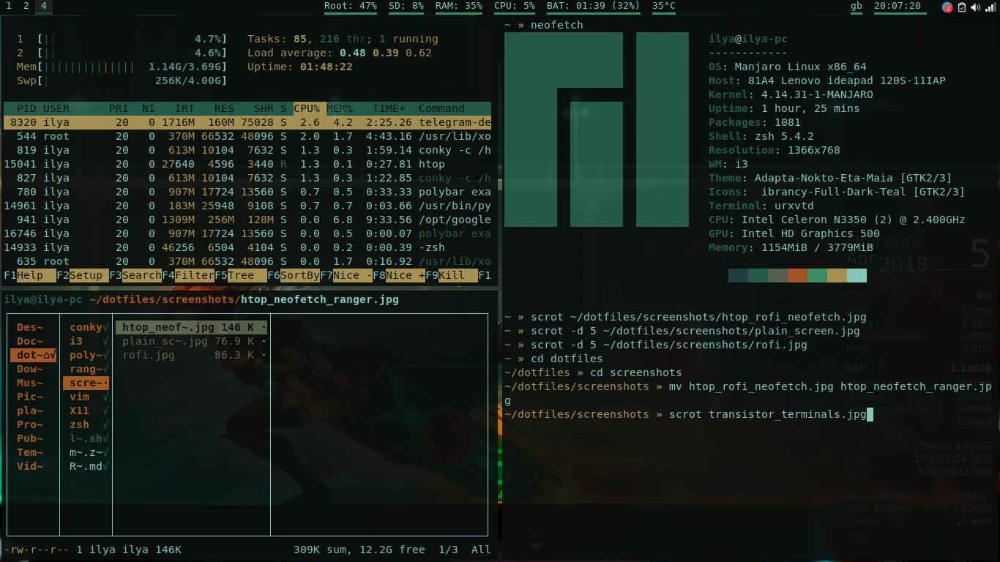

###### rofi

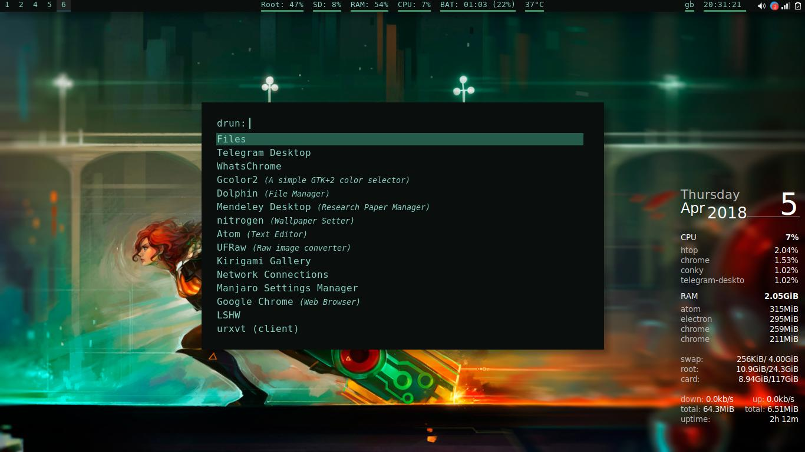

###### Lock screen

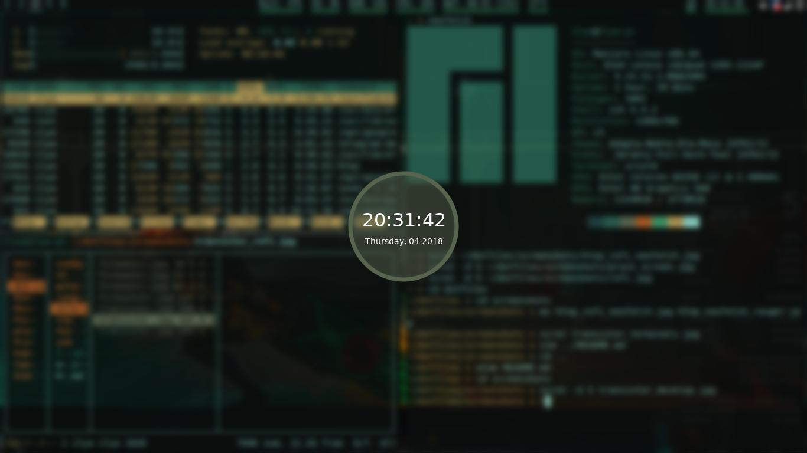

#### Pacman theme

[Wallpaper](https://i.imgur.com/mXQP1Rm.jpg)

###### Desktop

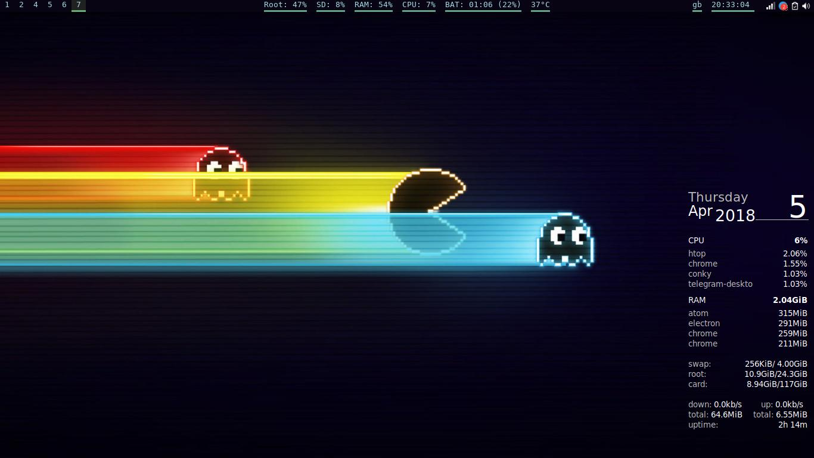

###### Terminals

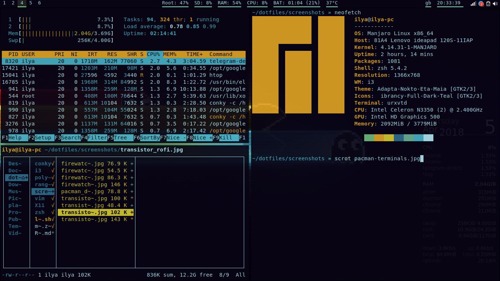

###### rofi

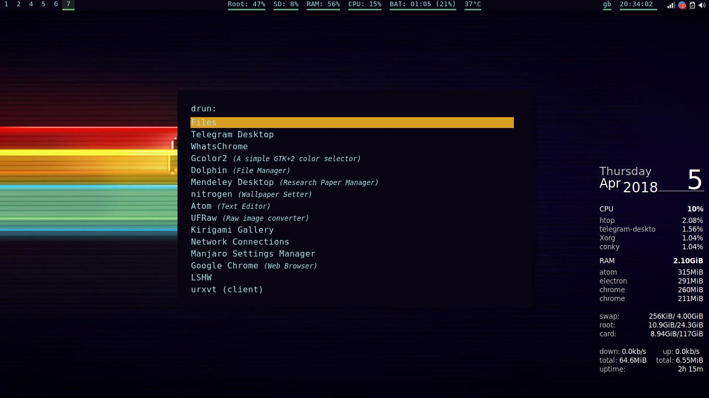

###### Lock screen

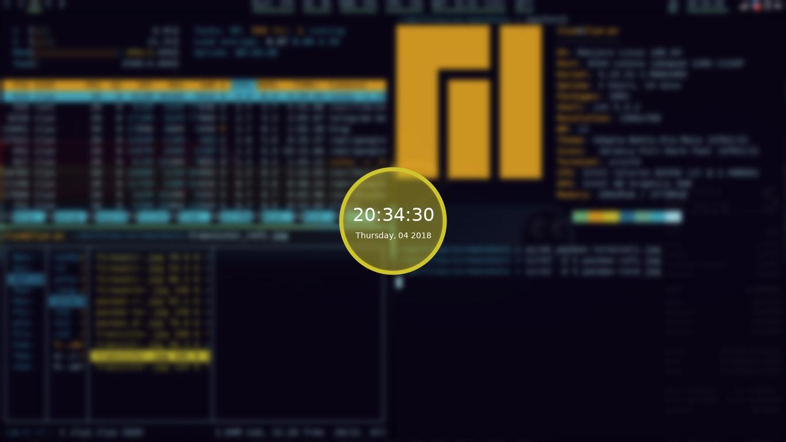
